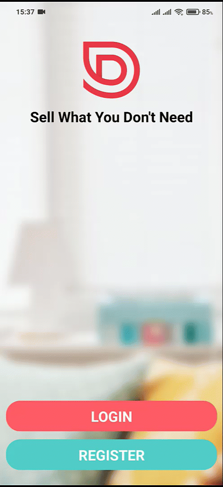

<h1 align="center">
  Hi 👋, I'm Laidi Zakaria
  <h6 align="center">A Mobile developer from Algeria</h6>
</h1>

<h1 align="center">
  <br>
  <a href="https://expo.dev/@zakaria_laidi/DoneWithIt"></a>
  <br>

**DoneWithIt**
<br>

</h1>

<h4 align="center">A marketplace for selling the stuff you don't need anymore built-in with <a href="https://reactnative.dev/" target="_blank">react native</a>.</h4>

<p align="center">
  <a href="#demo-preview">Demo Preview</a> •
  <a href="#what-i-learned">What I Learned</a> •
  <a href="#how-to-use">How To Use</a> •
  <a href="#license">License</a>
</p>

## Demo-Preview

<center>
  <table>
    <tr>
      <td></td>
      <td></td>
      <td></td>
    </tr>
    <tr>
      <td></td>
      <td></td>
      <td></td>
    </tr>
    <tr>
      <td></td>
      <td></td>
      <td></td>
    </tr>
  </table>
</center>

## What I learned ?

- Implement interface user with [ReactNative](https://reactnative.dev/) and Javascript.
- Learn basic of React Native.
  - Working with State, props, React-Hooks, LifeCycle methods...
  - Implement flexible Layout & Lists.
- Building reusable Components.
- Building Forms with [Formik](https://formik.org/).
- Implement Navigation with [React Navigation](https://reactnavigation.org/).
- Networking with the backend using Axios.
- Adding beautiful Animations.
- Building my custom Hooks.
- Working with hardware's Permissions.
- Adding Offline Support.
  - Store cache data offline.
  - Detecting Network Status.
- Implement Authentication & Authorization.
- Implement push Notifications Services.
- Publishing the App via Expo.
- Refactoring the code with Best Practices.

## How To Use ?

To clone and run this application, you'll need [Git](https://git-scm.com) and [Node.js](https://nodejs.org/en/download/) (which comes with [npm](http://npmjs.com)) installed on your computer. From your command line:

```bash
# Clone this repository
$ git clone https://github.com/Zakaria99laidi/DoneWithIt.git

# Go into the repository
$ cd DoneWithIt

# Install dependencies
$ npm install

# Run the app
$ expo start
```

## License

MIT

---

> [DoneWithIt Live](https://expo.dev/@zakaria_laidi/DoneWithIt) &nbsp;&middot;&nbsp;
> GitHub [@Zakaria99laidi](https://github.com/Zakaria99laidi) &nbsp;&middot;&nbsp;
> Linkedin [@zakaria_laidi](https://www.linkedin.com/in/zakaria-laidi-5a5525195/) &nbsp;&middot;&nbsp;
> Email: **gz_laidi@esi.dz**
